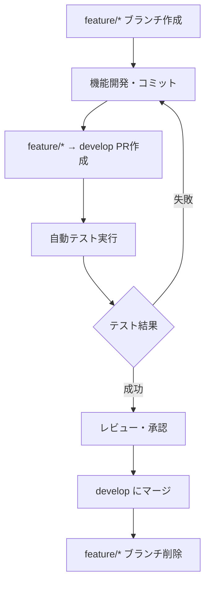
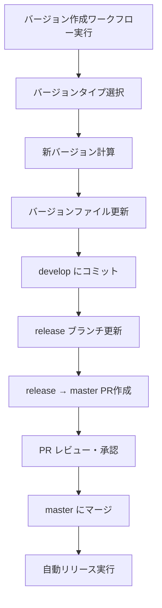

# 自動化セットアップガイド

## 概要
このガイドでは、plist_parserプロジェクトの自動化システムをセットアップする手順を説明します。

## 自動化機能
1. **依存関係の自動更新** (Dependabot)
2. **自動テスト・マージ** (Dependabot Auto-merge)
3. **手動バージョン作成ワークフロー** (Create Release Version)
4. **自動リリース・パッケージ公開** (Release)
5. **セキュリティスキャン** (Security Scan)

## 🔧 セットアップ手順

### 1. GitHubリポジトリの設定

#### A. ブランチ保護ルールの設定
1. GitHubリポジトリの `Settings` > `Branches` へ移動
2. `master` ブランチに保護ルールを追加:
   ```
   - Require a pull request before merging: ✅
   - Require approvals: 1
   - Dismiss stale PR approvals when new commits are pushed: ✅
   - Require status checks to pass before merging: ✅
     - build (from Build workflow)
   - Require branches to be up to date before merging: ✅
   - Restrict pushes that create files exceeding 100MB: ✅
   ```

3. `develop` ブランチに保護ルールを追加:
   ```
   - Require a pull request before merging: ✅
   - Require status checks to pass before merging: ✅
     - build (from Build workflow)
   - Require branches to be up to date before merging: ✅
   - Allow auto-merge: ✅ (Dependabot用)
   ```

#### B. ブランチの作成
```bash
# developブランチの作成
git checkout -b develop
git push origin develop

# releaseブランチの作成（初回のみ）
git checkout -b release
git push origin release
git checkout develop  # developに戻る
```

### 2. GitHub Secretsの設定

#### A. pub.dev APIトークンの取得と設定

**手順1: pub.dev認証情報の取得**
```bash
# ローカルでpub.devにログイン
dart pub login

# 認証情報を確認
cat ~/Library/Application\ Support/dart/pub-credentials.json
```

**手順2: GitHubSecretsの設定**
1. GitHubリポジトリの `Settings` > `Secrets and variables` > `Actions` へ移動
2. `New repository secret` をクリック
3. 以下の情報を追加:
   ```
   Name: PUB_DEV_CREDENTIALS
   Value: (上記で取得したcredentials.jsonの内容をそのまま貼り付け)
   ```

**認証情報の例:**
```json
{
  "accessToken": "ya29.a0AfH6SMC...",
  "refreshToken": "1//0GwPp9X6qJ...",
  "tokenEndpoint": "https://oauth2.googleapis.com/token",
  "scopes": ["openid", "https://www.googleapis.com/auth/userinfo.email"],
  "expiration": 1640995200000
}
```

**注意:**
- 実際の認証情報は絶対に公開しないでください
- トークンは定期的に更新される場合があります

#### B. Codecovトークンの設定（既存）
```
Name: CODECOV_TOKEN
Value: your-codecov-token
```

### 3. Dependabotの設定確認
`.github/dependabot.yml` が作成されているか確認し、必要に応じてusernameを変更:
```yaml
reviewers:
  - "your-github-username"  # あなたのGitHubユーザー名に変更
assignees:
  - "your-github-username"  # あなたのGitHubユーザー名に変更
```

## 🌊 ブランチフロー

このプロジェクトでは、Git Flowをベースとした独自のブランチ戦略を採用しています。

### ブランチ構成
```
master    ← 本番環境 (プロダクションリリース)
  ↑
release   ← リリース準備ブランチ
  ↑
develop   ← 開発統合ブランチ
  ↑
feature/* ← 機能開発ブランチ
```

### フロー図
```
feature → develop (自動PR作成、テスト、マージ)
          ↓
      手動でバージョン作成ワークフロー実行
          ↓
      develop（バージョンファイル更新）
          ↓
      release（developの内容を反映）
          ↓
      release → master（リリースPR作成）
          ↓
      master（自動リリース・pub.dev公開）
```

### 各ブランチの役割

#### 1. `master` ブランチ
- **用途**: 本番環境向けの安定版コード
- **保護**: 直接pushは禁止、PRのみ受け入れ
- **トリガー**: マージ時に自動リリース・パッケージ公開が実行

#### 2. `release` ブランチ
- **用途**: リリース候補の最終確認・調整
- **更新**: バージョン作成ワークフロー実行時にdevelopから自動更新
- **役割**: QAテスト、リリースノート確認、最終調整

#### 3. `develop` ブランチ
- **用途**: 開発版の統合ブランチ
- **更新**: feature/* ブランチからのマージ、バージョンファイル更新
- **役割**: 継続的インテグレーション、機能の統合テスト

#### 4. `feature/*` ブランチ
- **用途**: 個別機能の開発
- **命名**: `feature/機能名` (例: `feature/add-binary-parser`)
- **起点**: `develop` ブランチから分岐
- **マージ先**: `develop` ブランチへPR

## 🚀 ワークフローの動作

### 1. 機能開発ワークフロー


### 2. リリースワークフロー（手動実行）


### 3. 依存関係の自動更新（Dependabot）
- **頻度**: 
  - Dart/Flutter依存関係: 毎日 9:00 JST
  - GitHub Actions: 毎日 9:00 JST
- **動作**: 
  1. Dependabotが依存関係をチェック
  2. アップデートがあれば自動的にDependabotブランチ（`dependabot/pub/...` または `dependabot/github-actions/...`）を作成
  3. developブランチに対してPRを作成
- **対象ブランチ**: `develop` ← `dependabot/pub/...` または `dependabot/github-actions/...`

### 4. 自動マージ (Dependabot)
- **トリガー**: DependabotによるPR作成時
- **条件**: 
  - patch/minorアップデート
  - セキュリティアップデート
  - すべてのテストが通過
- **動作**: 
  1. コードの解析とテスト実行
  2. フォーマットチェック
  3. 自動承認・マージ（squash merge）
  4. Dependabotブランチは自動削除

### 5. 脆弱性対応の自動化
- **セキュリティアラート**: 即座にPRが作成され、自動マージ対象
- **重大な脆弱性**: 手動レビューが必要な場合はコメントで通知

### 6. バージョン作成ワークフロー（手動実行）
- **実行方法**: GitHub ActionsのWorkflowsタブから手動実行
- **入力**: バージョンタイプ（patch/minor/major）を選択
- **動作**: 
  1. セマンティックバージョニングでバージョンを計算
  2. コミット履歴から変更ログを生成
  3. pubspec.yaml、README.md、CHANGELOG.mdを更新
  4. developブランチにコミット
  5. releaseブランチを更新（developの内容を反映）
  6. `release` → `master` のPRを作成

### 7. 自動リリース
- **トリガー**: `master` ブランチへのマージ
- **動作**:
  1. 最終テスト実行
  2. コード解析・フォーマットチェック
  3. GitHubタグ作成（v1.2.3形式）
  4. GitHub Release作成（変更ログ付き）
  5. pub.devへパッケージ自動公開

### 8. セキュリティスキャン
- **頻度**: 毎日 2:00 JST
- **動作**: 依存関係の脆弱性チェック

## 📋 運用フロー

### 🔄 通常の開発フロー（推奨）

#### 1. 機能開発フロー
```bash
# 1. developから新しいfeatureブランチを作成
git checkout develop
git pull origin develop
git checkout -b feature/new-feature

# 2. 機能開発・コミット
git add .
git commit -m "feat: add new feature"

# 3. featureブランチをpush & PR作成
git push origin feature/new-feature
# GitHubでfeature/new-feature → develop のPRを作成

# 4. PR レビュー・承認後、developにマージ
# （自動テスト通過後、squash mergeでマージ）

# 5. ローカルのdevelopブランチを更新
git checkout develop
git pull origin develop
git branch -d feature/new-feature  # 不要になったfeatureブランチを削除
```

#### 2. リリースフロー
```bash
# 1. GitHub ActionsでCreate Release Versionワークフローを手動実行
# - GitHub → Actions → Create Release Version → Run workflow
# - バージョンタイプ（patch/minor/major）を選択して実行

# 2. ワークフローが以下を自動実行:
# - バージョンファイル（pubspec.yaml, README.md, CHANGELOG.md）更新
# - developブランチにコミット
# - releaseブランチを更新（developの内容を反映）
# - release → master のPRを自動作成

# 3. 作成されたリリースPRをレビュー
# - 変更内容の確認
# - CHANGELOGの確認
# - バージョンが正しいかチェック

# 4. リリースPRをmasterにマージ

# 5. 自動的に以下が実行される:
# - GitHubタグ作成（v1.2.3）
# - GitHub Release作成
# - pub.devにパッケージ公開
```

### 🤖 Dependabotによる自動更新フロー
```bash
# 1. 自動チェック実行
# - Dart/Flutter依存関係: 毎日 9:00 JST
# - GitHub Actions: 毎日 9:00 JST

# 2. アップデートがあれば自動的にDependabotブランチを作成
#    例: dependabot/pub/package_name-1.2.3
#    例: dependabot/github-actions/actions/checkout-4

# 3. developブランチへのPRが自動作成

# 4. 自動テスト実行
#    - コード解析（dart analyze）
#    - フォーマットチェック（dart format）
#    - 単体テスト（flutter test）

# 5. 結果に応じて自動処理
#    - patch/minor/securityアップデート → 自動承認・マージ
#    - majorアップデート → 手動レビューが必要

# 6. マージ後、Dependabotブランチは自動削除

# 7. 依存関係更新が蓄積されたら、手動でリリースワークフローを実行
```

### ⚡ 緊急修正フロー（ホットフィックス）
```bash
# 1. masterから直接hotfixブランチを作成
git checkout master
git pull origin master
git checkout -b hotfix/urgent-fix

# 2. 緊急修正・コミット
git add .
git commit -m "fix: urgent security fix"

# 3. hotfixブランチをpush & PR作成
git push origin hotfix/urgent-fix
# GitHub で hotfix/urgent-fix → master のPRを作成

# 4. 緊急時のためレビューを簡略化してmasterにマージ

# 5. 自動的にリリースが実行される

# 6. developブランチにもhotfixをマージ
git checkout develop
git pull origin develop
git merge master  # masterの変更をdevelopに反映
git push origin develop

# 7. hotfixブランチを削除
git branch -d hotfix/urgent-fix
git push origin --delete hotfix/urgent-fix
```

### 📊 ブランチごとの運用ルール

#### master ブランチ
- **直接push**: 🚫 禁止
- **マージ方法**: Pull Request のみ
- **マージ元**: release ブランチまたは hotfix/* ブランチ
- **保護設定**: 
  - レビュー必須（1名以上）
  - ステータスチェック必須（build workflow）
  - ブランチが最新である必要あり

#### release ブランチ
- **直接push**: 🚫 禁止（ワークフローからの自動更新のみ）
- **更新タイミング**: バージョン作成ワークフロー実行時
- **用途**: リリース候補の最終確認
- **削除**: 🚫 永続的に保持

#### develop ブランチ
- **直接push**: 🚫 禁止
- **マージ方法**: Pull Request のみ
- **マージ元**: feature/* ブランチ、dependabot/* ブランチ
- **保護設定**: 
  - ステータスチェック必須（build workflow）
  - 自動マージ有効（Dependabot PR）

#### feature/* ブランチ
- **命名規則**: `feature/機能名-概要` (例: `feature/add-binary-parser`)
- **起点**: develop ブランチ
- **マージ先**: develop ブランチ
- **削除**: ✅ マージ後に削除

#### dependabot/* ブランチ
- **作成**: Dependabot により自動作成
- **命名**: `dependabot/pub/パッケージ名-バージョン`
- **マージ**: 条件により自動マージまたは手動レビュー
- **削除**: ✅ マージ後に自動削除

## 🎯 開発フローの詳細解説

### 新しいブランチフローの特徴

この新しいフローは従来のGit Flowを改良し、CI/CDとの統合を重視した設計になっています：

#### 🔄 段階的リリースプロセス
```
feature開発 → develop統合 → release準備 → master本番
```

#### 🚀 手動バージョン管理
- **従来**: develop → master の自動PR作成
- **新方式**: 手動でバージョン作成ワークフロー実行
- **利点**: リリースタイミングを完全にコントロール可能

#### 🛡️ release ブランチによる品質保証
- developからreleaseブランチに自動反映
- release → master のPRで最終確認
- 本番リリース前の最後のゲート

### 各フェーズの責任と役割

#### Phase 1: 機能開発
```
feature/* → develop
```
- **責任**: 個別機能の実装とテスト
- **自動化**: PR作成、テスト実行、コードレビュー
- **マージ**: Squash merge

#### Phase 2: バージョン準備（手動トリガー）
```
developでバージョンファイル更新 → releaseブランチ反映
```
- **責任**: リリース準備、バージョン番号決定
- **自動化**: バージョンファイル更新、CHANGELOG生成
- **実行者**: プロジェクトメンテナー

#### Phase 3: リリース承認
```
release → master
```
- **責任**: 最終品質チェック、リリース承認
- **自動化**: PR作成、最終テスト
- **実行者**: プロジェクトメンテナー

#### Phase 4: 本番デプロイ
```
master → pub.dev公開
```
- **責任**: 本番環境へのデプロイ
- **自動化**: タグ作成、GitHub Release、パッケージ公開
- **実行者**: GitHub Actions

### ワークフロー実行手順（詳細）

#### 📝 バージョン作成ワークフローの実行
1. **GitHub Actionsにアクセス**
   ```
   GitHub Repository → Actions タブ → Create Release Version
   ```

2. **ワークフロー実行**
   ```
   Run workflow ボタンをクリック
   ↓
   バージョンタイプを選択（patch/minor/major）
   ↓
   Run workflow ボタンで実行開始
   ```

3. **自動実行される処理**
   - 現在のバージョン取得（pubspec.yaml）
   - 新しいバージョン計算
   - コミット履歴分析
   - CHANGELOG.md生成
   - pubspec.yaml, README.md更新
   - developブランチにコミット
   - releaseブランチ更新
   - release → master PR作成

#### ⚙️ リリースPRのレビューポイント
1. **バージョン確認**
   - pubspec.yamlのバージョンが正しいか
   - README.mdの依存関係バージョンが更新されているか

2. **CHANGELOG確認**
   - 新機能、バグ修正が適切に記載されているか
   - セマンティックバージョニングに従っているか

3. **差分確認**
   - 想定外の変更が含まれていないか
   - テストが通過しているか

4. **マージ実行**
   - すべて確認後、Merge pull requestを実行
   - 自動的にリリースプロセスが開始される

## ⚠️ 注意事項

1. **初回設定後の確認**
   - すべてのワークフローが正常に動作することを確認
   - テスト環境でワークフローをテストしてから本番運用開始

2. **pub.dev認証の更新**
   - pub.devのトークンは定期的に更新が必要な場合があります
   - 認証エラーが発生した場合は、新しいトークンを取得してSecretsを更新

3. **セキュリティ**
   - Secretsの値は絶対に公開しない
   - 定期的にアクセストークンをローテーション

4. **バージョニング**
   - バージョン作成は手動でワークフローを実行:
     - `patch`: バグ修正、小さな改善
     - `minor`: 新機能追加、後方互換性あり
     - `major`: 破壊的変更、後方互換性なし
   - コミットメッセージの推奨形式:
     - `feat:` 新機能
     - `fix:` バグ修正
     - `docs:` ドキュメント更新
     - `chore:` メンテナンス作業
     - `BREAKING CHANGE:` 破壊的変更

## 📞 トラブルシューティング

### よくある問題

1. **pub.dev公開が失敗する**
   - Secretsの `PUB_DEV_CREDENTIALS` を確認
   - pub.devのトークンが有効かチェック

2. **Dependabotが動作しない**
   - `.github/dependabot.yml` の設定を確認
   - GitHubのDependabot設定を確認

3. **自動マージが動作しない**
   - ブランチ保護ルールを確認
   - テストが通過しているかチェック

4. **バージョン作成ワークフローが失敗する**
   - developブランチの状態を確認
   - 権限設定（GITHUB_TOKEN）を確認
   - ワークフローのログを確認
   - pubspec.yamlのバージョン形式を確認（semantic versioning準拠）

5. **releaseブランチが更新されない**
   - releaseブランチが存在するか確認
   - developブランチにコミットがあるか確認
   - ブランチ保護ルールを確認
   - ワークフローの権限を確認

6. **リリースPRが作成されない**
   - releaseブランチとmasterブランチに差分があるか確認
   - 既存のリリースPRがないか確認
   - GitHub Actionsの権限設定を確認

7. **Create Release Versionワークフローが見つからない**
   - `.github/workflows/auto-release-pr.yml`が存在するか確認
   - ワークフローファイルの構文エラーを確認
   - mainブランチにワークフローファイルがプッシュされているか確認
